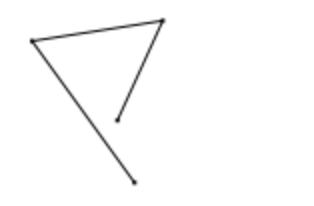

# How to draw a curve on an HTML Canvas

In a world where all vector editors have already been created, it is almost impossible to find information about how these editors work. It's a little sad, but don't worry — now we'll figure out how to draw and edit the curve.

## Model first

Let's figure out how to store information about the curve. The curve in vector editors combines segments of lines and Bezier curves. 

The simplest data type is the `Point` vector. The vector stores information about the coordinates `x` and `y` and methods of transformation of such vectors — addition, subtraction, multiplication, calculation of length, angle, etc.

[./src/point.ts](./src/point.ts)
```typescript
class Point {
  x: number;
  y: number;
  constructor(x: number = 0, y: number = 0){
    this.x = x;
    this.y = y;
  }
  copy():Point{}
  add(point:Point){
    ...
  }
  ...
}
```
The vector itself is not part of the model. But it will be useful to use it in other places.

The curve elements themselves can be described in different ways. For example, in the Illustrator, each node contains two guides, and in Glyphs, both the node and the guides are the same type.

The first and second methods have their pros and cons. When the guides are node properties, it is easier to draw and edit such a curve. The second method makes it easier to draw on Canvas by easy division into segments, and in some cases it is easier to edit.

Let's try to implement the Illustrator's method.

The model consists of several nested sets. At the top level there will be Drawing, it will be an element, like a layer in an Illustrator. Its task is to contain a set of Path paths. Each path contains a set of Nodes. Each node contains information about its location and the location of its guides.

[./src/drawing.ts](./src/drawing.ts)
[./src/path.ts](./src/path.ts)
[./src/node.ts](./src/node.ts)

```ts
class Drawing{
	paths: Path[] = [];
  constructor() {}
  ...
}

class Path{
	nodes: Node[] = [];
  constructor(){}
  ...
}

class Node{
  position: Point;
  out_handle: Point;
  in_handle: Point;
  constructor(position:Point){
    this.position = position.copy();
    this.out_handle = new Point();
    this.in_handle = new Point();
  }
  get x():number { return this.position.x; }
  get y():number { return this.position.y; }
  ...
}

```
Note that `Node` does not take two coordinates in the construction, but an object of the Point class at once. And the guides have relative coordinates.

## App

The main `BezierDrawer` class creates all the other classes, we will call it the application. The first thing you need to draw something is a Canvas element. You can pass the element ID to the constructor, you can pass the container ID and create the Canvas dynamically. For simplicity, let's make a constructor that accepts the element ID. By default, the ID will be `“canvas"`.

```ts
class BezierDrawer{
  constructor(id: string = "canvas") {
    const canvas = this._getCanvas(id);
    const context = canvas.getContext("2d");
		const drawing = new Drawing();
    drawing.make_test_drawing();
  }

  _getCanvas(id: string): HTMLCanvasElement {
    const canvas = document.getElementById(id) as HTMLCanvasElement;
    if (!canvas) {
      throw new Error("Canvas not found");
    }
    return canvas;
  }
}

```

In the constructor, the element is searched by ID, the context is found. And to check that everything is in order, let's create a `Drawing` and call the `make_test_drawing()` method — it creates several random points.

Important: in my example, the data model draws itself. Each element has an additional `draw(ctx)` method.  It turns out that Drawing calls the draw method for each path element.

```ts
// drawing.ts
draw(ctx:CanvasRenderingContext2D){
  for (let path of this.paths) {
    path.draw(ctx);
  }
}

```

The Path object draws its contents a little more complicated. First, he draws a line through all the points (at this point it's just a broken line — later it will become more complicated). Then — calls the draw method for each node.

```ts
// path.ts
draw(ctx: CanvasRenderingContext2D){
  ctx.beginPath()
  ctx.moveTo(this.nodes[0].x, this.nodes[0].y);
  for (let node of this.nodes) {
    ctx.lineTo(node.x, node.y);
  }
  ctx.stroke();
  // draw nodes
  for (let node of this.nodes) {
    node.draw(ctx);
  }
}

```

The Node element additionally checks if there are no guides — you don't need to draw them.

```ts
// node.ts
draw(ctx: CanvasRenderingContext2D){
  ctx.save()
  ctx.fillStyle = "black";
  ctx.fillRect(this.x-1, this.y-1, 2, 2);
  ctx.fillStyle = "red";
  if (!this.out_handle.is_zero())
    ctx.fillRect(this.out_handle.x-1+this.x, this.out_handle.y-1+this.y, 2, 2);
  if (!this.in_handle.is_zero())
    ctx.fillRect(this.in_handle.x-1+this.x, this.in_handle.y-1+this.y, 2, 2);
  ctx.restore()
}

```

Теперь в конструкторе BezierDrawing можно вызвать метод draw экземпляра класса Drawing: if (context) drawing.draw(context); и получим:



Great! Now you can proceed to the implementation of a simple tool.

## Event handling

To handle events, we will allocate a separate Listener class that will handle mouse events on the element. But first we will make some additional classes. The type of event and the event itself. While it is very simple, it stores the point and type of the event.

```tsx
class EventType { }
class PointerDown extends EventType {}

class CanvasEvent {
  pointer: Point;
  type: EventType;
  constructor(pointer:Point, type:EventType) {
    this.pointer = pointer;
    this.type = type;
  }
}
```

The listener class itself, for simplicity, adds a handler for pressing `pointerdown`, converts the mouse coordinates to normal and, if an event handler is installed, calls it, passing this custom event.

```tsx
class Listener {
  mouseHandler: Function|null = null;
  constructor(canvas: HTMLCanvasElement) {
    
    canvas.addEventListener("pointerdown", (e)=>{
      const x = e.clientX - canvas.offsetLeft;
      const y = e.clientY - canvas.offsetTop;
      let event = new CanvasEvent(new Point(x,y), new PointerDown());

      if (this.mouseHandler) this.mouseHandler(event);
    });
  }
}
```

Now you can add a handler in the application constructor and output the event in the console:

```tsx
const listener = new Listener(canvas);
listener.mouseHandler = (event: CanvasEvent) => { console.log(event); };
```

Great! Now you can proceed to the implementation of a simple tool.

## Tool

Let's create a base class Tool and a child class PenTool. For now, let's do with a simple method that receives a drawing and an event and just output it to the console.

```tsx
class Tool{}
PenTool extends Tool{
  pointerDown(drawing:Drawing, event:CanvasEvent){
    console.log(drawing, event);
  }
}
```

Add `const tool = new PenTool();` in the application constructor and change the handler for Eventer.

```tsx
listener.mouseHandler = (event: CanvasEvent) => {
  tool.pointerDown(drawing, event);
};
```

Now we can remove the call to the test method `drawing.make_test_drawing();`. And let's go back to PenTool and make it so that when we click the mouse, we call the method of adding a point.

First, let's stipulate the algorithm. For simplicity, we will edit the curve until it is closed. Only after that we start drawing a new one. This will solve the headache of storing information about what the active curve is now.

Add the closed variable to the boolean type Path with the default value false. And the method of adding a new node. 

```tsx
add_node(p:Point){
  this.nodes.push(new Node(p));
}
```

Now the PenTool class looks like this. It looks for an open path, if there is none, adds a new one and adds a new node.

```tsx
class PenTool extends Tool{
  pointerDown(drawing:Drawing, event:CanvasEvent){
    // find opened path
    let path = drawing.paths.find(p => p.closed == false)
    // if all closed, add new one
    if (!path) path = drawing.add_path();
    path.add_node(event.pointer)
  }
}
```

Now we can add new nodes, but there is a small problem. Nothing changes on canvas. And there is some ideological exchange. It is necessary to cause the canvas to be redrawn, but it is unclear who and when should do it. The easiest way is to redraw on every mouse click after PenTool has done its job. But what if the tool didn't do anything and then the redrawing will be unnecessary.

Then you can call a redraw in the tool itself, but it seems illogical, and the tool does not know anything about the canvas — it only has a model and an event.

The best, but not an easy solution, it seems to me would be to use an event from the model itself. That is, redraw when the model has changed. Usually, they use the Observer or Pub-sub pattern, adding a special class to the parents. We'll do with a simple property, where we'll write the event handler.

When creating a drawing, we will add a handler in which we will redraw the entire drawing

```tsx
drawing.onChange = () => {
  drawing.draw(context);
}
```

In the class itself, we will add such a property. Further down the tree, the drawing needs to subscribe to changes in the Path. This can be done in the method of adding a path.

```tsx
add_path():Path {
	let path = new Path();
	this.paths.push(path);
	path.onChange = () => {
	  this.onChange && this.onChange();
	}
	return path;
} 
```

And we will do the same when adding a node. Except that when adding a node, we will call the update callback. We will make the same variable in the node — this will be useful in order to send guide change events.

```tsx
add_node(p:Point):Node{
  let node = new Node(p)
  this.nodes.push(node);
  node.onChange = () => {
    this.onChange && this.onChange();
  }
  this.onChange && this.onChange();
  return node;
}
```

Now an update event is triggered along the chain. Adding a node, we call the path handler, which calls the drawing handler, which calls the application handler and the redrawing takes place.

I will immediately note that when there are a lot of calls (for example, during mass deletion), it is worth adding the suspend() and resume() methods that pause the handler, otherwise such a redrawing will take a long time, due to the large number. But more on that later.

Now the points are being added, the main thing is not to forget to clear the canvas by redrawing.


Next — drawing the curve…